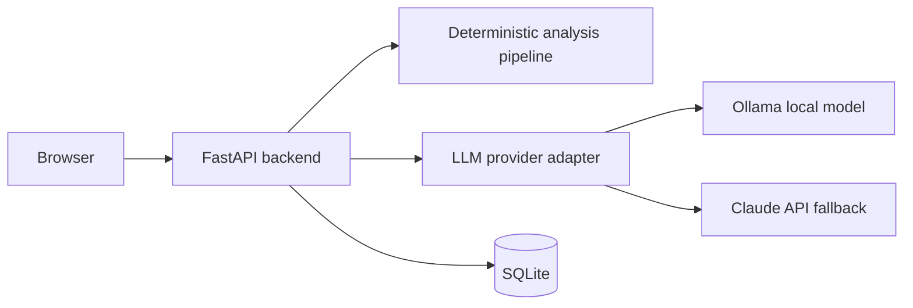

# Polyglot

Self-hosted pronunciation and grammar tutor for en-US and de-DE, with deterministic speech analysis and LLM explanations.


## Demo

Phase 1 headless analysis is complete. UI screenshots and GIF will be added in Phase 3.

## Table of contents

- Why this project
- Architecture
- Quickstart
- Configuration reference
- LLM provider switching
- CPU-only hosts
- Analyze endpoint
- Development
- License

## Why this project

Polyglot is built to separate deterministic speech analysis from LLM explanation. The ASR and phoneme layers detect measurable pronunciation and fluency issues first, then the LLM explains those findings in natural language.

This architecture avoids vibe-based correction and provides a concrete, inspectable contract between analysis and feedback. The result is easier to test, easier to trust, and easier to improve over time.

The repository is intentionally portfolio-grade: architecture, testing, operational reproducibility, and documentation are treated as first-class deliverables from Phase 0 onward.

## Architecture



## Quickstart

Prerequisites:

- Docker Desktop (Windows/macOS) or Docker Engine (Linux)
- Docker Compose v2
- Nvidia GPU path for default compose

Run:

1. Copy .env.example to .env and adjust values if needed.
2. Run docker compose up -d.
3. Open http://localhost:8000/healthz.

CPU-only hosts:

1. Run docker compose -f docker-compose.yml -f docker-compose.cpu.yml up -d.

## Configuration reference

| Variable | Required | Default | Description |
|---|---|---|---|
| APP_ENV | no | development | Runtime environment label |
| LOG_LEVEL | no | INFO | Logging level |
| HOST | no | 0.0.0.0 | API bind host |
| PORT | no | 8000 | API bind port |
| DEVICE | no | cuda | Inference device preference |
| LLM_PROVIDER | no | ollama | Feedback provider |
| LLM_MODEL | no | qwen2.5:7b-instruct | Provider model identifier |
| OLLAMA_BASE_URL | no | http://ollama:11434 | Ollama endpoint |
| ANTHROPIC_API_KEY | conditional | empty | Required when using Claude |
| WHISPER_MODEL | no | small | WhisperX model name |
| MIN_AUDIO_MS | no | 300 | Minimum allowed clip duration |
| MAX_AUDIO_MS | no | 30000 | Maximum allowed clip duration |
| PAUSE_THRESHOLD_MS | no | 700 | Pause threshold for fluency detection |
| DATABASE_URL | no | sqlite:///data/polyglot.db | SQLite connection string |
| DEMO_MODE | no | false | Reserved for Phase 5 demo seeding |

## LLM provider switching

Set LLM_PROVIDER to ollama or claude in .env. Model selection is controlled by LLM_MODEL.

## CPU-only hosts

Use docker-compose.cpu.yml override to remove GPU reservations and force DEVICE=cpu.

## Analyze endpoint

Phase 1 introduces `POST /analyze` for deterministic speech analysis.

Example:

```bash
curl -F "audio=@my_clip.wav" \
    -F "target_sentence=Ich wohne in Hamburg" \
    -F "language=de-DE" \
    http://localhost:8000/analyze
```

Response shape is schema-versioned and includes:

- `target`, `language`, `transcribed`
- `word_alignment` with optional phoneme error details
- `fluency` timing features
- `overall` objective scores

## Development

- Install tools: uv sync --group dev
- Lint: uv run ruff check .
- Type check: uv run mypy src
- Test: uv run pytest
- Import contracts: uv run lint-imports

Expected Docker footprint will increase significantly in Phase 1 once torch and ASR dependencies are introduced.

## License

MIT. See LICENSE.
