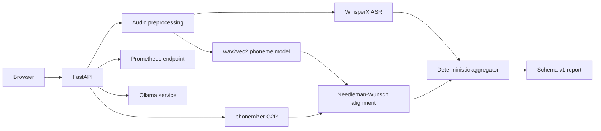

# Architecture

Phase 1 architecture adds deterministic analysis behind the `/analyze` endpoint.

```mermaid
flowchart LR
    Browser --> API[FastAPI]
    API --> Preprocess[Audio preprocessing]
    Preprocess --> ASR[WhisperX ASR]
    Preprocess --> Phoneme[wav2vec2 phoneme model]
    API --> G2P[phonemizer G2P]
    ASR --> Aggregate[Deterministic aggregator]
    Phoneme --> Align[Needleman-Wunsch alignment]
    G2P --> Align
    Align --> Aggregate
    Aggregate --> Report[Schema v1 report]
    API --> Metrics[Prometheus endpoint]
    API --> LLM[Ollama service]
```

Storage architecture is introduced in later phases.
