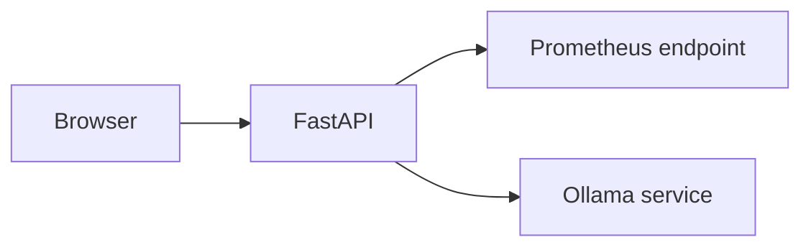

# Architecture

Phase 0 architecture is a minimal operational slice for reproducible startup and health validation.

Detailed analysis pipeline and storage architecture are documented in later phases.
